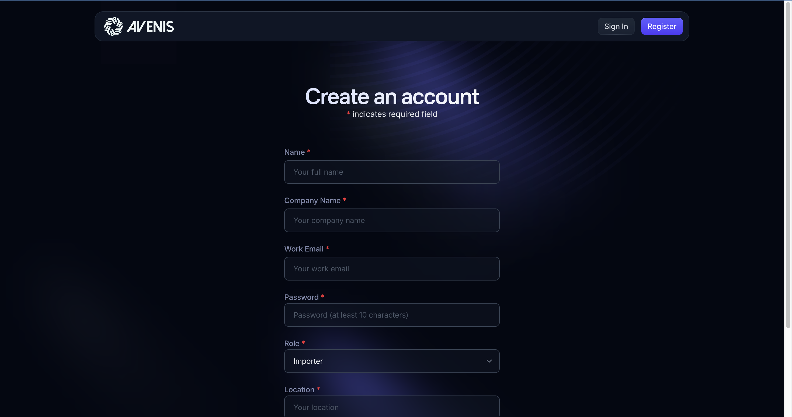

# Project Name

This is a TypeScript-based project that focuses on building a user registration system. The project is currently in progress, and this README will be updated as new features are implemented.

---

## Progress

### Completed Features

1. **User Registration Page**
   - A fully functional user registration page has been implemented.
   - The page includes form validation and error handling.
   - A screenshot of the registration page is included in the project directory for reference.
2. **User Login Page**
3. **User Profile Page**

---

## Screenshots

### Registration Page

---

## Getting Started

To run this project locally, follow these steps:

1. Clone the repository:
   ***
   git clone https://github.com/your-username/your-repo-name.git
   ***

2. Install dependencies:
   ***
   npm install
   ***

3. Start the development server:
   ***
   npm start
   ***

---

## Technologies Used

- **TypeScript**: Primary programming language.
- **React**: Frontend framework.
- **Next.js**: Frontend framework.
- **Other Libraries**: Tailwindcss.

---

## Future Updates

- Implement user login functionality.
- Add password reset feature.
- Improve UI/UX design.

---

## Contributing

Contributions are welcome! If you'd like to contribute, please follow these steps:

1. Fork the repository.
2. Create a new branch for your feature.
3. Commit your changes.
4. Submit a pull request.

---

## License

This project is licensed under the MIT License. See the [LICENSE](./LICENSE) file for details.

---

## Contact

If you have any questions or suggestions, feel free to reach out:

- **Email**: eyuelwoldehana@gmail.com
- **GitHub**: [your-username](https://www.github.com/Eyuelwoldeh)